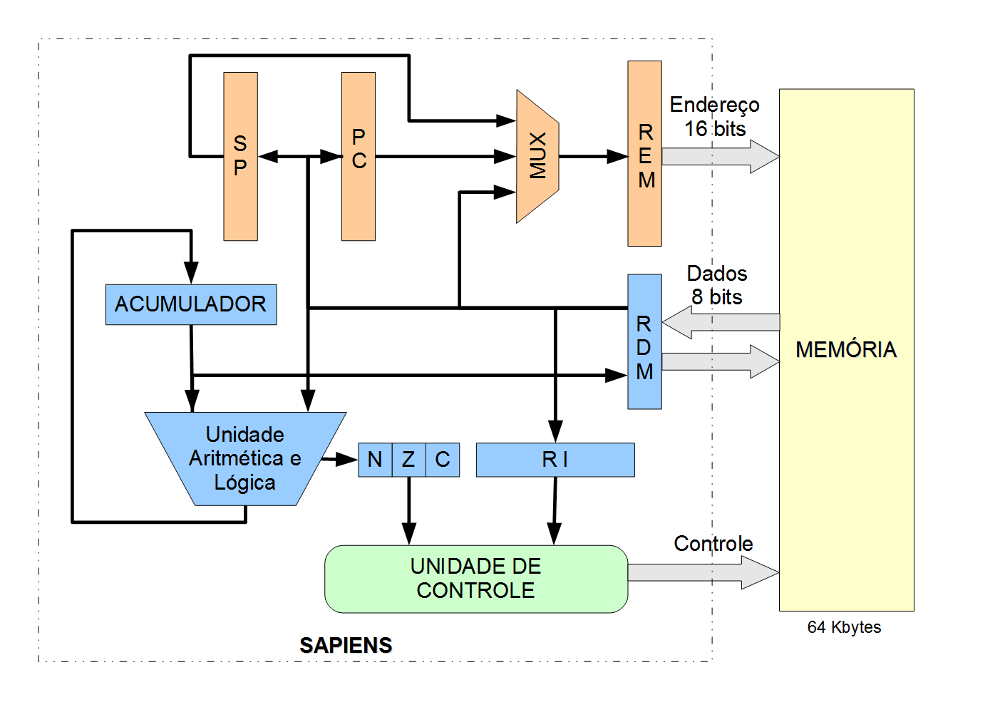
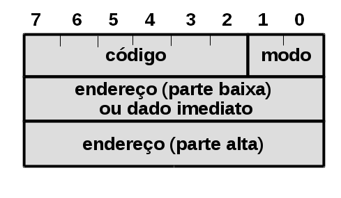

# SimuS + Sapiens

### Manual de Uso e Descrição da Arquitetura

1.  **Apresentação**

A máquina Neander, como definida originalmente \[3\], é uma arquitetura
baseada em acumulador muito simples, de caráter didático, que pode ser
facilmente apresentada em poucas horas. Algumas características do
processador original da máquina Neander incluem:

-   Largura de dados e endereços de 8 bits;
-   Dados representados em complemento a dois;
-   Acumulador de 8 bits (AC);
-   Apontador de instruções de 8 bits (PC);
-   Registrador de código de condição com 2 bits: negativo (N) e zero
    (Z).

O Neander só possui um modo de endereçamento: o modo direto (absoluto),
no qual a palavra que segue o código da instrução contém, nas instruções
de manipulação de dados, o endereço de memória do operando. Nas
instruções de desvio, esse endereço corresponde à posição de memória
onde está a próxima instrução a ser executada.

O conjunto de instruções da máquina original do Neander foi estendido
para incluir alguns detalhes na sua arquitetura. Essa nova arquitetura
estendida, em uma primeira versão chamada de Neander-X \[2\] e agora em
uma arquitetura totalmente renovada, denominada Sapiens\[1\], cujo
diagrama em blocos é mostrado na Figura 1, incluiu, entre outros
detalhes:

-   O modo imediato de acesso aos operandos, simplificando as operações
    de atribuição de dados;
-   Um modo indireto de endereçamento, possibilitando exercitar as
    noções de indexação e ponteiros – que são fundamentais para
    entendimento de qualquer estrutura básica de programação;
-   Operações de entrada e saída de dados para dispositivos E/S, em
    espaço de endereçamento separado da memória;
-   Incremento da largura do apontador de instruções (PC) para 16 bits,
    permitindo endereçar até 64 Kbytes;
-   Um apontador de pilha (SP, do inglês stack pointer), também de 16
    bits, para possibilitar a chamada e o retorno de rotinas e
    procedimentos;
-   Um código de condição (flag) C (do inglês carry) para o vai-um e
    também vem-um;
-   Uma instrução de TRAP para chamada do simulador para realizar
    operações mais elaboradas de E/S;
-   Um conjunto novo de instruções de movimentação de pilha,
    deslocamento do registrador, soma e subtração com vai-um/vem, entre
    outras.

  

<!-- -->

1.  **Formato das Instruções e Modos de Endereçamento**

  
As instruções em linguagem de máquina do processador Sapiens podem ter
um, dois ou três bytes (8 bits), conforme pode ser visto na Figura 2.

Nas instruções, o primeiro byte sempre contém o código de operação nos 6
bits mais significativos e, quando for o caso,  o modo de endereçamento
nos 2 bits menos significativos. As instruções com apenas um byte não
tem outro operando além do acumulador, que é um operando implícito para
quase todas as instruções. As instruções com dois bytes são aquelas que,
além do acumulador, usam um dado imediato de 8 bits como operando no
segundo byte da instrução.

Nas instruções com 3 bytes os dois últimos bytes podem conter o endereço
de memória do operando (modo direto), ou o endereço de memória do
ponteiro para o operando (modo indireto) ou ainda o próprio operando
(modo imediato de 16 bits). Note que nos dois primeiros modos de
endereçamento o operando em si possui apenas um byte de comprimento. A
codificação para o modo de endereçamento é a seguinte:

-   **00 - Direto:** o segundo e terceiro bytes da instrução contêm o
    endereço do operando;
-   **01 - Indireto:** o segundo e terceiro bytes da instrução contêm o
    endereço da posição de memória com o endereço do operando (ou seja,
    é o endereço do ponteiro para o operando). Na linguagem de montagem,
    usou-se como convenção para indicar que um operando é indireto
    precedê-lo pela letra "@" (arroba);
-   **10 - Imediato 8 bits:** o segundo byte da instrução é o próprio
    operando. Na linguagem de montagem, usou-se como convenção para
    indicar que um operando é indireto precedê-lo pela letra "#"
    (tralha).
-   **11 - Imediato 16 bits:** os dois bytes seguintes à instrução são
    utilizados como operando. Na linguagem de montagem, usou-se como
    convenção para indicar que um operando é indireto precedê-lo pela
    letra "#" (tralha). O montador fica encarregado de gerar a
    codificação do operando no tamanho correto de acordo com a
    instrução. A única instrução que utiliza este modo é a LDS (Load
    Stack Pointer).

  

<!-- -->

1.  **Códigos de Condição**

  
A seguir são apresentados os códigos de condição do processador Sapiens,
ou seja, flags que indicam o resultado da última operação realizada pela
UAL.

-   **N – (negativo):** 1 – o resultado é negativo;  0 – o resultado não
    é negativo;
-   **Z – (zero):** 1 – indica que o resultado é igual a zero; 0 –
    indica que o resultado é diferente de zero;
-   **C – (vai-um):** 1 – indica que a última operação resultou em
    ”vai-um” (carry), no caso de soma, ou ”vem-um” (borrow) em caso de
    subtração; 0 – o resultado não deu nem ”vai-um” ou ”vem-um”.

1.  **Descrição das Instruções**

O conjunto original de instruções foi expandido para permitir uma maior
capacidade de processamento. Todas as instruções originais do Neander-X
foram mantidas, com exceção da instrução LDI (load immediate), que ainda
é aceita pelo novo montador, mas na geração do programa em linguagem de
máquina foi substituída pela instrução LDA #imed, que realiza a mesma
função. Ou seja, um código escrito para os processadores Neander ou
Neander-X é totalmente compatível e executado sem problemas no SimuS.

Como destaque para as novas instruções introduzidas na arquitetura temos
a adição e subtração com carry, (ADC e SBC), novas instruções lógicas
como “ou” exclusivo, deslocamento para a direita e esquerda do
acumulador (XOR, SHL, SHR e SRA), novas instruções de desvio condicional
(JP, JC, JNC), instruções para chamada e retorno de procedimento (JSR e
RET), instruções para a manipulação da pilha (PUSH e POP), além da
própria inclusão do apontador de pilha (SP) e das instruções de carga e
armazenamento do apontador de pilha em memória (LDS e STS).

As instruções lógicas e aritméticas (ADD, ADC, SUB, SBC, NOT, AND, OR,
XOR, SHL, SHR, SRA) e as instruções de transferência LDA, LDS e POP
afetam apenas os códigos de condição N e Z de acordo com o resultado
produzido. As instruções lógicas e aritméticas (ADD, ADC, SUB, SBC, SHL,
SHR, SRA) afetam também o código de condição C de acordo com o resultado
produzido. As demais instruções (STA, STS, JMP, JN, JP, JZ, JNZ, JC,
JNC, JSR, RET, PUSH, IN, OUT, NOP e HLT) não alteram os códigos de
condição.

A seguir apresentamos uma tabela completa com as instruções do Sapiens e
os respectivos códigos de operação.

TABELA I. Tabela de Instruções 

<table width="450" data-cellspacing="0">
<thead>
<tr class="header">
<th width="66" height="1" style="border: 1px solid #00000a; padding-top: 0cm; pa
dding-bottom: 0cm; padding-left: 0.19cm; padding-right: 0.19cm">
<strong>Mnemônico</strong>
</th>
<th width="52" style="border: 1px solid #00000a; padding-top: 0cm; padding-botto
m: 0cm; padding-left: 0.19cm; padding-right: 0.19cm">
<strong>Código</strong>
</th>
<th width="165" style="border: 1px solid #00000a; padding-top: 0cm; padding-bott
om: 0cm; padding-left: 0.19cm; padding-right: 0.19cm">
<strong>Descrição</strong>
</th>
</tr>
</thead>
<tbody>
<tr class="odd">
<td width="66" style="border: 1px solid #00000a; padding-top: 0cm; padding-botto
m: 0cm; padding-left: 0.19cm; padding-right: 0.19cm">
NOP</
span>
</td>
<td width="52" style="border: 1px solid #00000a; padding-top: 0cm; padding-botto
m: 0cm; padding-left: 0.19cm; padding-right: 0.19cm">
0000 
0000
</td>
<td width="165" style="border: 1px solid #00000a; padding-top: 0cm; padding-bott
om: 0cm; padding-left: 0.19cm; padding-right: 0.19cm">
Não 
faz nada
</td>
</tr>
<tr class="even">
<td width="66" style="border: 1px solid #00000a; padding-top: 0cm; padding-botto
m: 0cm; padding-left: 0.19cm; padding-right: 0.19cm">
STA e
nder 

STA @ender
</td>
<td width="52" style="border: 1px solid #00000a; padding-top: 0cm; padding-botto
m: 0cm; padding-left: 0.19cm; padding-right: 0.19cm">
0001 
000x
</td>
<td width="165" style="border: 1px solid #00000a; padding-top: 0cm; padding-bott
om: 0cm; padding-left: 0.19cm; padding-right: 0.19cm">
Arma
zena o acumulador (um byte) na memória
</td>
</tr>
<tr class="odd">
<td width="66" height="7" style="border: 1px solid #00000a; padding-top: 0cm; pa
dding-bottom: 0cm; padding-left: 0.19cm; padding-right: 0.19cm">
STS ender 

STS @ender
</td>
<td width="52" style="border: 1px solid #00000a; padding-top: 0cm; padding-botto
m: 0cm; padding-left: 0.19cm; padding-right: 0.19cm">
0001 
010x
</td>
<td width="165" style="border: 1px solid #00000a; padding-top: 0cm; padding-bott
om: 0cm; padding-left: 0.19cm; padding-right: 0.19cm">
Arma
zena o apontador de pilha (dois bytes) na memória 
</td>
</tr>
<tr class="even">
<td width="66" height="7" style="border: 1px solid #00000a; padding-top: 0cm; pa
dding-bottom: 0cm; padding-left: 0.19cm; padding-right: 0.19cm">
LDA #imed

LDA ender

LDA @ender
</td>
<td width="52" style="border: 1px solid #00000a; padding-top: 0cm; padding-botto
m: 0cm; padding-left: 0.19cm; padding-right: 0.19cm">
0010 
00xx
</td>
<td width="165" style="border: 1px solid #00000a; padding-top: 0cm; padding-bott
om: 0cm; padding-left: 0.19cm; padding-right: 0.19cm">
Carr
ega o operando (um byte) no acumulador
</td>
</tr>
<tr class="odd">
<td width="66" height="7" style="border: 1px solid #00000a; padding-top: 0cm; pa
dding-bottom: 0cm; padding-left: 0.19cm; padding-right: 0.19cm">
LDS #imed16</
p>

LDS ender

LDS @ender
</td>
<td width="52" style="border: 1px solid #00000a; padding-top: 0cm; padding-botto
m: 0cm; padding-left: 0.19cm; padding-right: 0.19cm">
0010 
01xx
</td>
<td width="165" style="border: 1px solid #00000a; padding-top: 0cm; padding-bott
om: 0cm; padding-left: 0.19cm; padding-right: 0.19cm">
Carr
ega o operando (dois bytes) no apontador de pilha (SP)
</td>
</tr>
<tr class="even">
<td width="66" height="7" style="border: 1px solid #00000a; padding-top: 0cm; pa
dding-bottom: 0cm; padding-left: 0.19cm; padding-right: 0.19cm">
ADD #imed

ADD ender

ADD @ender
</td>
<td width="52" style="border: 1px solid #00000a; padding-top: 0cm; padding-botto
m: 0cm; padding-left: 0.19cm; padding-right: 0.19cm">
0011 
00xx
</td>
<td width="165" style="border: 1px solid #00000a; padding-top: 0cm; padding-bott
om: 0cm; padding-left: 0.19cm; padding-right: 0.19cm">
Soma
 o acumulador com o operando (um byte)
</td>
</tr>
<tr class="odd">
<td width="66" height="7" style="border: 1px solid #00000a; padding-top: 0cm; pa
dding-bottom: 0cm; padding-left: 0.19cm; padding-right: 0.19cm">
ADC #imed

ADC ender

ADC @ender
</td>
<td width="52" style="border: 1px solid #00000a; padding-top: 0cm; padding-botto
m: 0cm; padding-left: 0.19cm; padding-right: 0.19cm">
0011 
01xx
</td>
<td width="165" style="border: 1px solid #00000a; padding-top: 0cm; padding-bott
om: 0cm; padding-left: 0.19cm; padding-right: 0.19cm">
Soma
 o acumulador com o carry (flag C) e com o operando (um byte)
</td>
</tr>
<tr class="even">
<td width="66" height="7" style="border: 1px solid #00000a; padding-top: 0cm; pa
dding-bottom: 0cm; padding-left: 0.19cm; padding-right: 0.19cm">
SUB #imed

SUB ender

SUB @ender
</td>
<td width="52" style="border: 1px solid #00000a; padding-top: 0cm; padding-botto
m: 0cm; padding-left: 0.19cm; padding-right: 0.19cm">
0011 
10xx
</td>
<td width="165" style="border: 1px solid #00000a; padding-top: 0cm; padding-bott
om: 0cm; padding-left: 0.19cm; padding-right: 0.19cm">
Subt
rai o acumulador do operando (um byte)
</td>
</tr>
<tr class="odd">
<td width="66" height="7" style="border: 1px solid #00000a; padding-top: 0cm; pa
dding-bottom: 0cm; padding-left: 0.19cm; padding-right: 0.19cm">
SBC #imed

SBC ender

SBC @ender
</td>
<td width="52" style="border: 1px solid #00000a; padding-top: 0cm; padding-botto
m: 0cm; padding-left: 0.19cm; padding-right: 0.19cm">
0011 
11xx
</td>
<td width="165" style="border: 1px solid #00000a; padding-top: 0cm; padding-bott
om: 0cm; padding-left: 0.19cm; padding-right: 0.19cm">
Subt
rai o acumulador do carry (flag C) e do operando (um byte)
</td>
</tr>
<tr class="even">
<td width="66" height="7" style="border: 1px solid #00000a; padding-top: 0cm; pa
dding-bottom: 0cm; padding-left: 0.19cm; padding-right: 0.19cm">
OR #imed

OR ender

OR @ender
</td>
<td width="52" style="border: 1px solid #00000a; padding-top: 0cm; padding-botto
m: 0cm; padding-left: 0.19cm; padding-right: 0.19cm">
0100 
00xx
</td>
<td width="165" style="border: 1px solid #00000a; padding-top: 0cm; padding-bott
om: 0cm; padding-left: 0.19cm; padding-right: 0.19cm">
Real
iza um ''ou'' bit a bit entre o acumulador e o operando (um byte)
</td
>
</tr>
<tr class="odd">
<td width="66" height="7" style="border: 1px solid #00000a; padding-top: 0cm; pa
dding-bottom: 0cm; padding-left: 0.19cm; padding-right: 0.19cm">
XOR #imed

XOR ender 

XOR @ender
</td>
<td width="52" style="border: 1px solid #00000a; padding-top: 0cm; padding-botto
m: 0cm; padding-left: 0.19cm; padding-right: 0.19cm">
0100 
01xx
</td>
<td width="165" style="border: 1px solid #00000a; padding-top: 0cm; padding-bott
om: 0cm; padding-left: 0.19cm; padding-right: 0.19cm">
Real
iza um ''ou exclusivo'' bit a bit entre o acumulador e o operando (um byte)</spa
n>
</td>
</tr>
<tr class="even">
<td width="66" height="7" style="border: 1px solid #00000a; padding-top: 0cm; pa
dding-bottom: 0cm; padding-left: 0.19cm; padding-right: 0.19cm">
AND #imed

AND ender

AND @ender
</td>
<td width="52" style="border: 1px solid #00000a; padding-top: 0cm; padding-botto
m: 0cm; padding-left: 0.19cm; padding-right: 0.19cm">
0101 
00xx
</td>
<td width="165" style="border: 1px solid #00000a; padding-top: 0cm; padding-bott
om: 0cm; padding-left: 0.19cm; padding-right: 0.19cm">
Real
iza um ''e'' bit a bit entre o acumulador e o operando (um byte)
</td>
</tr>
<tr class="odd">
<td width="66" height="7" style="border: 1px solid #00000a; padding-top: 0cm; pa
dding-bottom: 0cm; padding-left: 0.19cm; padding-right: 0.19cm">
NOT
</td>
<td width="52" style="border: 1px solid #00000a; padding-top: 0cm; padding-botto
m: 0cm; padding-left: 0.19cm; padding-right: 0.19cm">
0110 0000
</td>
<td width="165" style="border: 1px solid #00000a; padding-top: 0cm; padding-bott
om: 0cm; padding-left: 0.19cm; padding-right: 0.19cm">
Comp
lementa ('0'  '1' e '1' </s
pan> '0') os bits do acumulador.</
span>
</td>
</tr>
<tr class="even">
<td width="66" height="7" style="border: 1px solid #00000a; padding-top: 0cm; pa
dding-bottom: 0cm; padding-left: 0.19cm; padding-right: 0.19cm">
SHL
</td>
<td width="52" style="border: 1px solid #00000a; padding-top: 0cm; padding-botto
m: 0cm; padding-left: 0.19cm; padding-right: 0.19cm">
0111 0000
</td>
<td width="165" style="border: 1px solid #00000a; padding-top: 0cm; padding-bott
om: 0cm; padding-left: 0.19cm; padding-right: 0.19cm">
Desl
ocamento do acumulador de um bit para a esquerda, através do <em>carry</em>
</td>
</tr>
<tr class="odd">
<td width="66" height="7" style="border: 1px solid #00000a; padding-top: 0cm; pa
dding-bottom: 0cm; padding-left: 0.19cm; padding-right: 0.19cm">
SHR
</td>
<td width="52" style="border: 1px solid #00000a; padding-top: 0cm; padding-botto
m: 0cm; padding-left: 0.19cm; padding-right: 0.19cm">
0111 0100
</td>
<td width="165" style="border: 1px solid #00000a; padding-top: 0cm; padding-bott
om: 0cm; padding-left: 0.19cm; padding-right: 0.19cm">
Desl
ocamento do acumulador de um bit para a direita através do <em>carry</em>
</td>
</tr>
<tr class="even">
<td width="66" height="7" style="border: 1px solid #00000a; padding-top: 0cm; pa
dding-bottom: 0cm; padding-left: 0.19cm; padding-right: 0.19cm">
SRA
</td>
<td width="52" style="border: 1px solid #00000a; padding-top: 0cm; padding-botto
m: 0cm; padding-left: 0.19cm; padding-right: 0.19cm">
0111 1000
</td>
<td width="165" style="border: 1px solid #00000a; padding-top: 0cm; padding-bott
om: 0cm; padding-left: 0.19cm; padding-right: 0.19cm">
Desl
ocamento do acumulador de um bit para a direita através do <em>carry</em>
</td>
</tr>
<tr class="odd">
<td width="66" height="7" style="border: 1px solid #00000a; padding-top: 0cm; pa
dding-bottom: 0cm; padding-left: 0.19cm; padding-right: 0.19cm">
JMP ender 

JMP @ender
</td>
<td width="52" style="border: 1px solid #00000a; padding-top: 0cm; padding-botto
m: 0cm; padding-left: 0.19cm; padding-right: 0.19cm">
1000 
000x
</td>
<td width="165" style="border: 1px solid #00000a; padding-top: 0cm; padding-bott
om: 0cm; padding-left: 0.19cm; padding-right: 0.19cm">
Desv
ia a execução do programa para o endereço
</td>
</tr>
<tr class="even">
<td width="66" height="7" style="border: 1px solid #00000a; padding-top: 0cm; pa
dding-bottom: 0cm; padding-left: 0.19cm; padding-right: 0.19cm">
JN ender

JN @ender
</td>
<td width="52" style="border: 1px solid #00000a; padding-top: 0cm; padding-botto
m: 0cm; padding-left: 0.19cm; padding-right: 0.19cm">
1001 
000x
</td>
<td width="165" style="border: 1px solid #00000a; padding-top: 0cm; padding-bott
om: 0cm; padding-left: 0.19cm; padding-right: 0.19cm">
Desv
ia a execução do programa para o endereço, apenas se N = 1
</td>
</tr>
<tr class="odd">
<td width="66" height="7" style="border: 1px solid #00000a; padding-top: 0cm; pa
dding-bottom: 0cm; padding-left: 0.19cm; padding-right: 0.19cm">
JP ender

JP @ender
</td>
<td width="52" style="border: 1px solid #00000a; padding-top: 0cm; padding-botto
m: 0cm; padding-left: 0.19cm; padding-right: 0.19cm">
1001 
010x
</td>
<td width="165" style="border: 1px solid #00000a; padding-top: 0cm; padding-bott
om: 0cm; padding-left: 0.19cm; padding-right: 0.19cm">
Desv
ia a execução do programa para o endereço, apenas se N = 0 e Z = 0
</t
d>
</tr>
<tr class="even">
<td width="66" height="7" style="border: 1px solid #00000a; padding-top: 0cm; pa
dding-bottom: 0cm; padding-left: 0.19cm; padding-right: 0.19cm">
JZ ender 

JZ @ender
</td>
<td width="52" style="border: 1px solid #00000a; padding-top: 0cm; padding-botto
m: 0cm; padding-left: 0.19cm; padding-right: 0.19cm">
1010 
000x
</td>
<td width="165" style="border: 1px solid #00000a; padding-top: 0cm; padding-bott
om: 0cm; padding-left: 0.19cm; padding-right: 0.19cm">
Desv
ia a execução do programa para o endereço, apenas se Z = 1
</td>
</tr>
<tr class="odd">
<td width="66" height="7" style="border: 1px solid #00000a; padding-top: 0cm; pa
dding-bottom: 0cm; padding-left: 0.19cm; padding-right: 0.19cm">
JNZ ender

JNZ @ender
</td>
<td width="52" style="border: 1px solid #00000a; padding-top: 0cm; padding-botto
m: 0cm; padding-left: 0.19cm; padding-right: 0.19cm">
1010 
010x
</td>
<td width="165" style="border: 1px solid #00000a; padding-top: 0cm; padding-bott
om: 0cm; padding-left: 0.19cm; padding-right: 0.19cm">
Desv
ia a execução do programa para o endereço, apenas se Z = 0
</td>
</tr>
<tr class="even">
<td width="66" height="7" style="border: 1px solid #00000a; padding-top: 0cm; pa
dding-bottom: 0cm; padding-left: 0.19cm; padding-right: 0.19cm">
JC ender

JC @ender
</td>
<td width="52" style="border: 1px solid #00000a; padding-top: 0cm; padding-botto
m: 0cm; padding-left: 0.19cm; padding-right: 0.19cm">
1011 
000x
</td>
<td width="165" style="border: 1px solid #00000a; padding-top: 0cm; padding-bott
om: 0cm; padding-left: 0.19cm; padding-right: 0.19cm">
Desv
ia a execução do programa para o endereço, apenas se C =1
</td>
</tr>
<tr class="odd">
<td width="66" height="7" style="border: 1px solid #00000a; padding-top: 0cm; pa
dding-bottom: 0cm; padding-left: 0.19cm; padding-right: 0.19cm">
JNC ender

JNC @ender
</td>
<td width="52" style="border: 1px solid #00000a; padding-top: 0cm; padding-botto
m: 0cm; padding-left: 0.19cm; padding-right: 0.19cm">
1011 
010x
</td>
<td width="165" style="border: 1px solid #00000a; padding-top: 0cm; padding-bott
om: 0cm; padding-left: 0.19cm; padding-right: 0.19cm">
Desv
ia a execução do programa para o endereço, apenas se C = 0
</td>
</tr>
<tr class="even">
<td width="66" height="7" style="border: 1px solid #00000a; padding-top: 0cm; pa
dding-bottom: 0cm; padding-left: 0.19cm; padding-right: 0.19cm">
IN ender8
</td>
<td width="52" style="border: 1px solid #00000a; padding-top: 0cm; padding-botto
m: 0cm; padding-left: 0.19cm; padding-right: 0.19cm">
1100 
0000
</td>
<td width="165" style="border: 1px solid #00000a; padding-top: 0cm; padding-bott
om: 0cm; padding-left: 0.19cm; padding-right: 0.19cm">
Carr
ega no acumulador o valor lido no endereço de E/S
</td>
</tr>
<tr class="odd">
<td width="66" height="7" style="border: 1px solid #00000a; padding-top: 0cm; pa
dding-bottom: 0cm; padding-left: 0.19cm; padding-right: 0.19cm">
OUT ender8
</td>
<td width="52" style="border: 1px solid #00000a; padding-top: 0cm; padding-botto
m: 0cm; padding-left: 0.19cm; padding-right: 0.19cm">
1100 
0100
</td>
<td width="165" style="border: 1px solid #00000a; padding-top: 0cm; padding-bott
om: 0cm; padding-left: 0.19cm; padding-right: 0.19cm">
Desc
arrega o conteúdo do acumulador no endereço de E/S
</td>
</tr>
<tr class="even">
<td width="66" height="7" style="border: 1px solid #00000a; padding-top: 0cm; pa
dding-bottom: 0cm; padding-left: 0.19cm; padding-right: 0.19cm">
JSR ender

JSR @ender
</td>
<td width="52" style="border: 1px solid #00000a; padding-top: 0cm; padding-botto
m: 0cm; padding-left: 0.19cm; padding-right: 0.19cm">
1101 
000x
</td>
<td width="165" style="border: 1px solid #00000a; padding-top: 0cm; padding-bott
om: 0cm; padding-left: 0.19cm; padding-right: 0.19cm">
Desv
ia para procedimento
</td>
</tr>
<tr class="odd">
<td width="66" height="7" style="border: 1px solid #00000a; padding-top: 0cm; pa
dding-bottom: 0cm; padding-left: 0.19cm; padding-right: 0.19cm">
RET
</td>
<td width="52" style="border: 1px solid #00000a; padding-top: 0cm; padding-botto
m: 0cm; padding-left: 0.19cm; padding-right: 0.19cm">
1101 1000
</td>
<td width="165" style="border: 1px solid #00000a; padding-top: 0cm; padding-bott
om: 0cm; padding-left: 0.19cm; padding-right: 0.19cm">
Reto
rno de procedimento
</td>
</tr>
<tr class="even">
<td width="66" height="7" style="border: 1px solid #00000a; padding-top: 0cm; pa
dding-bottom: 0cm; padding-left: 0.19cm; padding-right: 0.19cm">
PUSH
</td>
<td width="52" style="border: 1px solid #00000a; padding-top: 0cm; padding-botto
m: 0cm; padding-left: 0.19cm; padding-right: 0.19cm">
1110 0000
</td>
<td width="165" style="border: 1px solid #00000a; padding-top: 0cm; padding-bott
om: 0cm; padding-left: 0.19cm; padding-right: 0.19cm">
Colo
ca o conteúdo do acumulador no topo da pilha
</td>
</tr>
<tr class="odd">
<td width="66" height="7" style="border: 1px solid #00000a; padding-top: 0cm; pa
dding-bottom: 0cm; padding-left: 0.19cm; padding-right: 0.19cm">
POP
</td>
<td width="52" style="border: 1px solid #00000a; padding-top: 0cm; padding-botto
m: 0cm; padding-left: 0.19cm; padding-right: 0.19cm">
1110 0100
</td>
<td width="165" style="border: 1px solid #00000a; padding-top: 0cm; padding-bott
om: 0cm; padding-left: 0.19cm; padding-right: 0.19cm">
Reti
ra o valor que está no topo da pilha e coloca no acumulador
</td>
</tr>
<tr class="even">
<td width="66" height="7" style="border: 1px solid #00000a; padding-top: 0cm; pa
dding-bottom: 0cm; padding-left: 0.19cm; padding-right: 0.19cm">
TRAP ender

TRAP @ender
</td>
<td width="52" style="border: 1px solid #00000a; padding-top: 0cm; padding-botto
m: 0cm; padding-left: 0.19cm; padding-right: 0.19cm">
1111 0000
</td>
<td width="165" style="border: 1px solid #00000a; padding-top: 0cm; padding-bott
om: 0cm; padding-left: 0.19cm; padding-right: 0.19cm">
Inst
rução para emulação de rotinas de E/S pelo simulador
</td>
</tr>
<tr class="odd">
<td width="66" height="6" style="border: 1px solid #00000a; padding-top: 0cm; pa
dding-bottom: 0cm; padding-left: 0.19cm; padding-right: 0.19cm">
HLT
</td>
<td width="52" style="border: 1px solid #00000a; padding-top: 0cm; padding-botto
m: 0cm; padding-left: 0.19cm; padding-right: 0.19cm">
1111 
1111
</td>
<td width="165" style="border: 1px solid #00000a; padding-top: 0cm; padding-bott
om: 0cm; padding-left: 0.19cm; padding-right: 0.19cm">
Para
 a máquina
</td>
</tr>
</tbody>
</table>

Foi definida uma linguagem de montagem para este processador obedecendo
às regras usualmente encontradas nos sistemas comerciais e compatível
com a sintaxe previamente utilizada no simulador Neanderwin. A sintaxe
completa dos comandos do montador pode ser vista a seguir:

- Comentários Os comentários são começados por **ponto e vírgula (;)** e podem também ocorrer no final das linhas de instruções.                                                                       
                                                                                
- Rótulos Um rótulo é um nome dado à próxima posição de memória. Deve ser seguido por **dois pontos (:)**.         
                                                                                
- ORG ender   A di
retiva **ORG** (origin) indi ca ao montador que a próxima instrução ou dados devem ser colocados na posição de memória indicada por *ender*.                                                                      

- var EQU imed A diretiva **EQU** (equate) associa um nome (rótulo) a um certo valor. Esse comando é freqüentemente usado para especificar variáveis que são posicionadas em um endereço específico de memória. Por exemplo, para posicionar a variável X no endereço 100 use: X EQU 100. 
- END ender  A diretiva **END** indica que o programa fonte acabou. O operando *ender* é usado para pré-carregar o PC com o endereço inicial de execução do programa.                                                             
- DS imed A diretiva **DS** (define storage) reserva um número de palavras na memória definido pelo valor *imed*.                              
                                                                                
- DB imed1, imed2, imed3 ...  A diretiva **DB** (define byte) carrega nesta palavra de memória e nas seguintes o(s) valor(es) de 8bits definido(s) pelo(s) operando(s) *imed1, imed2, imed3*<
span lang="pt-BR"> ...                                                   

- DB imed1, imed2, imed3 ...  A diretiva **DB** (define word) carrega nesta palavra de memória e nas seguintes o(s) valor(es) de 16 bits definido(s) pelo(s) operando(s) *imed1, imed2, imed3* ...                                                 
  
- STR “cadeia de caracteres” | A diretiva **STR** (define string) carrega nesta palavra de memória e nas seguintes o(s) valor(es) o código ASCII correspondente aos caracteres da cadeia entre aspas.               
                                                                                
  
Na maioria são mnemônicos e comandos com sintaxe simplificada e de fácil utilização. A seguir um exemplo de programa em linguagem de montagem para o processador Sapiens:
 
<table width="450" data-cellpadding="3" data-cellspacing="0">
<tbody>
<tr class="odd">
<td width="450" data-valign="top" style="border: 1px solid #000001; padding: 0.1
9cm">
<strong>ORG 0</strong>

<strong>INICIO:</strong>

<strong>; Faz a leitura do painel de chaves</strong>

       <strong>IN  0</strong>

       <strong>STA A</strong>

<strong>; Se a entrada for 0 termina o programa</strong></
span>

       <strong>AND 0</strong>

       <strong>JZ  FIM</strong>

<strong>; Testa se é par (bit 0=0)</strong>

       <strong>LDA A</strong>

       <strong>AND #1</strong>

       <strong>JNZ SENAO</strong>

<strong>; Se for, faz pares++</strong>

       <strong>LDA PARES</strong>

       <strong>ADD #1</strong>

       <strong>STA PARES</strong>

       <strong>JMP INICIO</strong>

<strong>SENAO:</strong>

<strong>; Incrementa I</strong>

       <strong>LDA IMPARES</strong>

       <strong>ADD #1</strong>

       <strong>STA IMPARES</strong>

       <strong>JMP INICIO</strong>

<strong>FIM:    HLT</strong>

 

<strong>ORG 100</strong>

<strong>A:      DS  1</strong>

<strong>PARES:  DS  1</strong>

<strong>IMPARES:DS  1</strong>

<strong>END 0</strong>
</td>
</tr>
</tbody>
</table>

1.  **Simulando operações de E/S usando a instrução TRAP**

No sentido de ampliar e facilitar a capacidade de realizar operações de
E/S introduzimos um artifício que é a utilização da instrução TRAP para
isso. Em um processador real a instrução de TRAP desvia a execução para
uma rotina do sistema operacional para realizar um determinado serviço
ou operação de E/S para o programa do usuário. Em nosso simulador foi
criado um mecanismo para facilitar a leitura e escrita em dispositivos
de E/S mais complexos sem a necessidade de expor esta complexidade para
os usuários do simulador.

Neste mecanismo a instrução TRAP é interpretada pelo simulador como um
pedido para que ele realize uma determinada operação de E/S. O número do
trap, ou seja, a função que está sendo solicitada é passada no
acumulador. Como o processador Sapiens é carente de registradores, a
instrução TRAP tem um operando adicional que é o endereço de memória
onde os parâmetros adicionais necessários são passados para o módulo do
simulador responsável pela realização da operação. Temos previsão para
suportar inicialmente as seguintes operações:

-   **#1 –** leitura de um caractere da console. O código ASCII
    correspondente é colocado no acumulador.
-   **#2 –** escrita de um caractere que está no endereço definido pelo
    operando da instrução TRAP na console.
-   **#3 –** leitura de uma linha inteira da console para o endereço
    definido pelo operando da instrução TRAP.
-   **#4 –** escrita de uma linha inteira na console. O operando da
    instrução TRAP contém o endereço para a cadeia de caracteres que
    deve ser terminada pelo caractere NULL (0x00). O tamanho máximo da
    cadeia é de 128 caracteres.
-   **#5 –** chama uma rotina de temporização. O operando da instrução
    TRAP contém o endereço da variável com o tempo a ser esperado em
    milissegundos.
-   **#6 –** chama uma rotina para tocar um tom. A frequência e a
    duração do tom estão em duas variáveis inteiras no endereço definido
    pelo operando da instrução TRAP.
-   **#7 –** chama uma rotina para retornar um número pseudo-aleatório
    entre 0 e 99 no acumulador. O operando da instrução TRAP tem o
    endereço com a variável com a semente inicial.

1.  **A Interface de Usuário do Simulador SimuS**

 

Mantivemos a interface básica do simulador do Neanderwin, acrescentando
mais algumas funcionalidades e agora destacando os módulos de E/S, que
estão em janelas que são ativadas apenas quando for conveniente para o
usuário. Desde o início do projeto do simulador SimuS nosso objetivo era
facilitar ao máximo as atividades didáticas do professor e o apoio mais
completo possível para as dificuldades comuns do aluno. Para isso foi
criado um ambiente integrado para desenvolvimento, com versões para os
sistemas operacionais Windows e Linux, e que inclui os seguintes
módulos:

-   Editor de textos integrado, que possibilita a abertura, edição e
    salvamento de arquivo com o código em linguagem de montagem.
-   Montador (assembler) também integrado, gerando o código objeto final
    em linguagem de montagem. Possui compatibilidade com programas
    escritos para o Neander ou Neander-X.
-   Simulador da arquitetura, com visualização e modificação dos
    elementos arquiteturais do processador, tais como registrador de
    instrução, apontador de instrução, apontador de pilha, acumulador,
    flags N, Z e C; além da execução passo-a-passo ou direta.
-   Módulo de depuração, definindo pontos de parada e variáveis em
    memória para serem monitoradas, em caso de mudança de valor a
    execução é interrompida.
-   Visualização e modificação da memória simulada, no formato
    hexadecimal os endereços e também para seu conteúdo, agora expandida
    para 64 Kbytes.
-   Ferramenta de apoio ao aprendizado de instruções, com ajuda
    integrada ao editor de textos, para a geração de código em linguagem
    de montagem do processador Sapiens.
-   Utilitário para conversão de bases binária, decimal e hexadecimal.
-   Simulador de dispositivos de E/S, que inclui os tradicionais painel
    com 8 chaves e visor hexadecimal, acrescidos de um teclado de 12
    teclas e um “banner” de 16 linhas. Estes dispositivos são acessados
    no espaço de endereçamento de E/S convencional com instruções de IN
    e OUT.
-   Dispositivos especiais como uma console virtual, acessada pelo
    mecanismo descrito anteriormente. Com esse mecanismo outros módulos
    mais complexos possam ser facilmente instalados, sem necessidade de
    expor esta complexidade para os usuários.
-   Gerador/carregador de imagem da memória simulada, podendo ser salva
    em formato hexadecimal. Note que neste caso a compatibilidade entre
    o Simus e o Neanderwin não é mantida, ou seja, a imagem salva em um
    simulador não pode ser carregada em outro.

A Figura 3 mostra a aparência da tela principal do simulador SimuS. Na
parte superior estão o menu geral de operação (Arquivo, Editar, etc.) e
diversos botões usados em conjunto com o editor de textos, que seguem o
estilo usual de programas com interface gráfica.

Uma vez criado o programa ele será compilado, o que provoca o
aparecimento de uma janela pop-up com a listagem, cujo formato de saída
é similar à maioria dos montadores profissionais, com indicação dos
eventuais erros de compilação. O programa compilado é carregado
imediatamente na memória, sendo o conteúdo atualizado e exibido no
painel correspondente. Caso se deseje, é possível copiar o conteúdo
desta janela para a área de transferência, para colar em algum editor de
textos possibilitando eventuais embelezamentos e impressão a posteriori.

O número de instruções do processador Sapiens é relativamente pequeno,
mas apesar disso notamos que é importante tornar disponível uma “ajuda
online” interativa, que é ativada pelo menu do programa, um sistema de
entrada interativa de instruções e pseudo-instruções. A função de
criação tutorada de programas faz com que o aluno cometa menos erros e a
compreenda melhor o significado das instruções e produza uma sintaxe das
instruções mais correta, de forma interativa.

Por último, notamos que para muitos estudantes o domínio das
representações hexadecimal e binária, necessário para verificar e
alterar a memória, só se dá depois de algum tempo. Mesmo sabendo que as
calculadoras do Windows e do Linux exibem resultados em várias bases,
incluímos um conversor de bases, que é muito mais simples.

1.  **Referências**

 

\[1\] G. P. Silva, J. A. S. Borges "SimuS - Um Simulador Para o Ensino
de Arquitetura de Computadores". WEAC, 2016.

\[2\] J. A. S. Borges, G. P. Silva “NeanderWin - um simulador didático
para uma arquitetura do tipo acumulador”. WEAC, 2006.

\[3\] R. F. Weber, Fundamentos de Arquitetura de Computadores. 2. Ed.
Porto Alegre: Instituto de Informática da UFRGS: Sagra Luzzatto, 2001.

1.  **Download**

  

A seguir a versão executável do programa SimuS, com versões para Windows
e Linux, com 32 e 64 bits, pode ser baixada no repositório
[Sourceforge](https://sourceforge.net/projects/simus/files).

1.  **E-book**

Este mini-livro eletronico apresenta alguns exemplos de uso em linguagem
de montagem sobre o SimuS:

[SimuS: Simulador para Arquitetura de
Computadores](https://goo.gl/cSH6rU)

1.  **Autores**

  

  Os autores são pesquisadores e professores da UFRJ e podem ser
contactados pelo endereço a seguir.

  

 José Antônio Borges  (antonio2 at nce dot ufrj dot br)

  

 Gabriel P. Silva ( gabriel at dcc dot ufrj dot br)

  

Chapada dos Veadeiros - GO

Last  Updated: 08.Ago.2017

